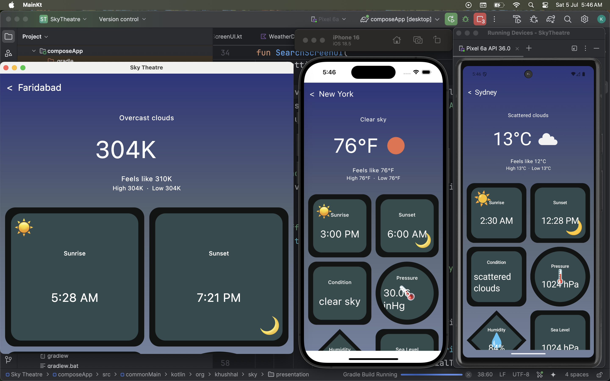
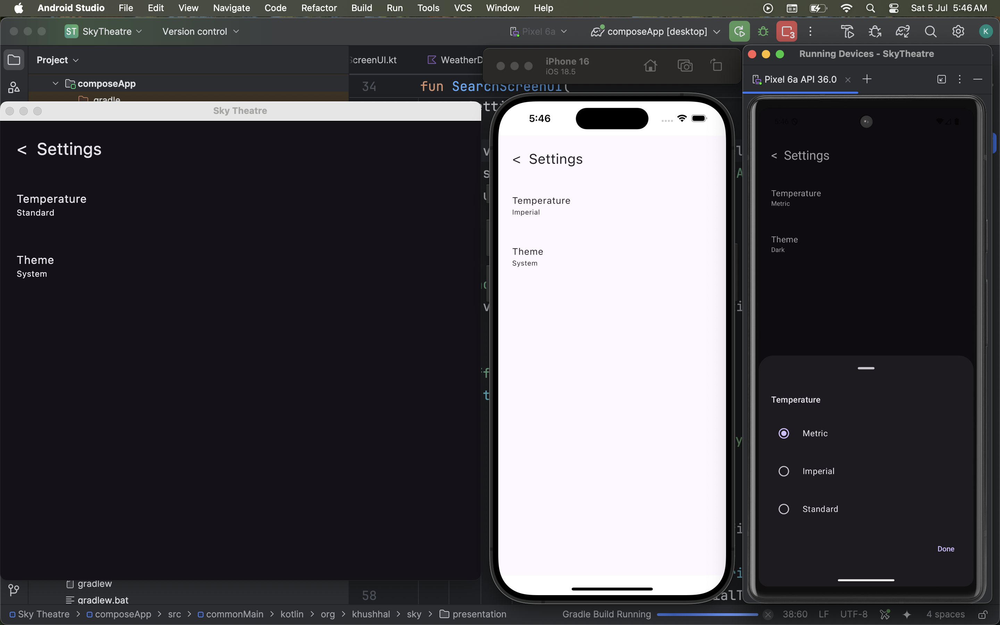
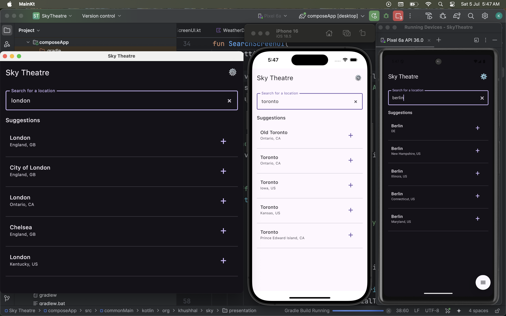

# 🌤️ Sky Theatre – A Modern Cross-Platform Weather App Built with Kotlin Multiplatform (KMP)

🚀 **Sky Theatre** is a fully functional, beautifully designed **cross-platform weather application** developed using **Kotlin Multiplatform (KMP)** and **Compose Multiplatform**, delivering a seamless experience across **Android, iOS, and Desktop** — all from a **single codebase**.

---

## ✨ Key Features

✅ Real-time weather updates based on any city  
✅ Search suggestions for faster city lookup  
✅ Save favorite cities locally with **Room Database (Offline Support)**  
✅ Clean, responsive, and **Material Design 3** inspired UI  
✅ Light 🌞 & Dark 🌙 themes for an adaptive user experience  
✅ Detailed weather insights:
- Current temperature
- Weather conditions
- Sunrise & Sunset times 🌅🌙
- Pressure, Humidity, Sea Level and more 🌡️  
  ✅ Temperature unit toggle (°C ↔ °F)  
  ✅ Smooth navigation with **Voyager**  
  ✅ Dependency Injection using **Koin**  
  ✅ Async image loading with **Kamel**  
  ✅ Built on **Clean Architecture + MVVM + Coroutines & Flow**

---

## 🛠 Tech Stack

| Layer           | Technologies Used                                              |
|----------------|----------------------------------------------------------------|
| **UI**         | Compose Multiplatform, MaterialTheme3, Voyager                 |
| **Business**   | Shared Kotlin Code, Clean MVVM Architecture, Coroutines, Flow  |
| **Data**       | Ktor Client, Room Database (for All Platforms), Koin DI, Kamel |

---

## 📱 Platforms Supported

- ✅ **Android**
- ✅ **iOS**
- ✅ **Desktop** (macOS, Windows, Linux)

---

## 🖥️ Screenshots

### 🌦 Detailed Weather Screen



---

### 🔍️ Search & Saved Locations


---

### Setting Screen



---

### 🔍️ Search Suggestions



---

## 📐 Architecture Overview

The project follows **Clean Architecture** with a strict separation of concerns:

Presentation (Compose Multiplatform, Voyager, ViewModels)
│
Domain (Use Cases, Business Logic, Models)
│
Data (Ktor, Room, Repository pattern)


✅ **MVVM pattern** for state and event management  
✅ **Koin DI** for easy testing and modularity  
✅ **Flow & Coroutines** for reactive asynchronous programming

---

## 🔗 Getting Started

1. Clone the repo:
```bash
git clone https://github.com/your-username/sky-theatre.git
```
2. Open in Android Studio (Giraffe or later) with KMP Multiplatform Plugin installed.
3. Add your openweathermap api key in data/remote/WeatherApi.kt
4. Run on
    Android Emulator or Device
    iOS Simulator (Mac only)
    Desktop (Compose for Desktop)

🤝 About Me

I’m passionate about building modern, scalable applications using cutting-edge technologies like Kotlin Multiplatform (KMP), Compose Multiplatform, and Clean Architecture.

👉 Always open to feedback, collaborations, and opportunities in Mobile & Cross-Platform development.